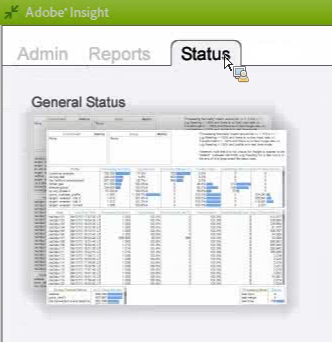
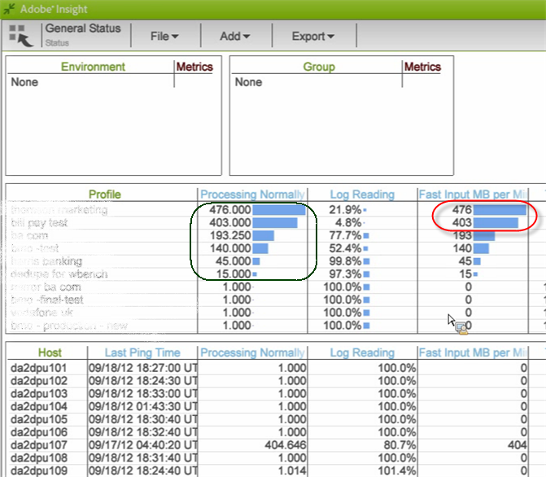
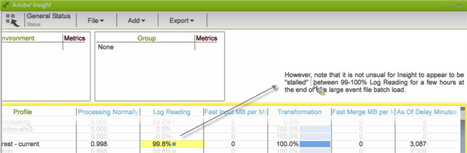

# Data Workbench Profile Status workspace{#data-workbench-profile-status-workspace}

The data workbench Profile Status profile provides current information about the data workbench server health based on the profile rather than server metrics or historical data.

## Data Workbench Profile Status {#section-65d1fa393cfd450cbacef3cba823fcc1}

This status profile provides the data workbench server information that is current, but not quite real-time because the agent is polled every ten minutes and reporting always includes this ten-minute latency. More precisely, the datasets generated by this profile provide the latest observation of the server from the agent, which most often has a default polling period of ten minutes.

For additional reference information about the dimensions used in the data workbench Profile Status profile, see [Insight Profile Status profile](../../../home/monitoring-installation/monitoring-profiles/monitoring-profile-using.md#concept-d4cd7da41c8a42bab4aea25418264e64).

This report is more for monitoring operations rather than components or specific traffic fluctuations. 

This gives us a sense of who is in what mode: If we see a high Fast Input rate for a certain profile then that profile is in Fast Input mode.

If the Stalled metric is 1, then the server is stalled. If the value is 0, then the server is not stalled.

**Log Reading for large batch loads** 

