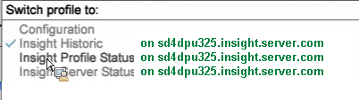

# Workspaces for Monitoring the Data Workbench Server{#workspaces-for-monitoring-the-data-workbench-server}

To successfully identify server health and performance, you can use standard data workbench profiles to monitor the server from the installed agent using current data, or employ profiles of historic data sets to view the impact of performance changes over time.

The data workbench workspaces most commonly used include:

* [Insight Historic workspace](../../../home/monitoring-installation/monitoring-profiles/monitoring-historical-using.md#concept-4a4661f3728540e699b92dac80c44015) 
* [Insight Profile Status workspace](../../../home/monitoring-installation/monitoring-profiles/monitoring-profile-using.md#concept-b4f472ece1094abc9192d89fdce5e104) 
* [Insight Server Status workspace](../../../home/monitoring-installation/monitoring-profiles/monitoring-server-using.md#concept-b4f472ece1094abc9192d89fdce5e104)

To select a profile, open the drop-down menu from the upper-left corner of the data workbench Client interface. 

