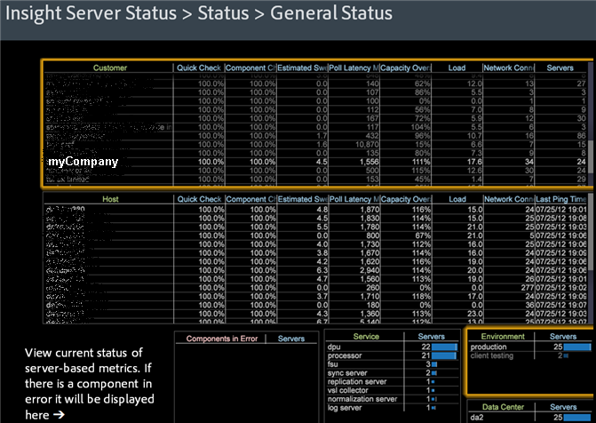

# Data Workbench Server Status workspace{#data-workbench-server-status-workspace}

The data workbench Server Status profile provides current information about data workbench server health based on the server rather than profile metrics or historical data.

## General Status {#section-65d1fa393cfd450cbacef3cba823fcc1}

Open the General Status dataset view within the data workbench Server Status profile.

For additional reference information about the dimensions used in the data workbench Server Status profile, see the [Dimensions in the Insight Server Status profile](../../../home/monitoring-installation/monitoring-appendix/monitoring-servers-profile.md#concept-8cbeb91e99bc42e2b52b22d551423f8a) profile.

## Disk Status {#section-36406f5f1262457e89ff13ad917f621f}

View current disk usage including internal usage of temp.db. 

